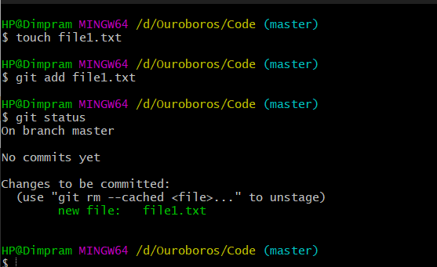
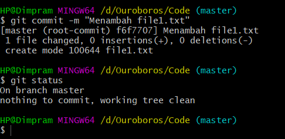

# Menambah File
Untuk menambah file baru ke Repository, kita dapat melakukannya seperti biasa ketika kita membuat file baru. File baru yang ditambahkan akan secara otomatis berada di working directory. Secara default, file baru yang ditambahkan tersebut tidak akan ditrack perubahannya. Sehingga, agar perubahan dapat ditrack, kita harus memindahkannya dari Working Directory ke Staging Area/Index.

## Menambah dan Memindahkan file baru ke Staging Index


## Commit ke repository


Untuk melakukan commit ke repository, kita dapat menggunakan command ```git commit -m "(message)"```. "-m" pada command tersebut berarti pesan atau keterangan ketika kita commit ke repository.
