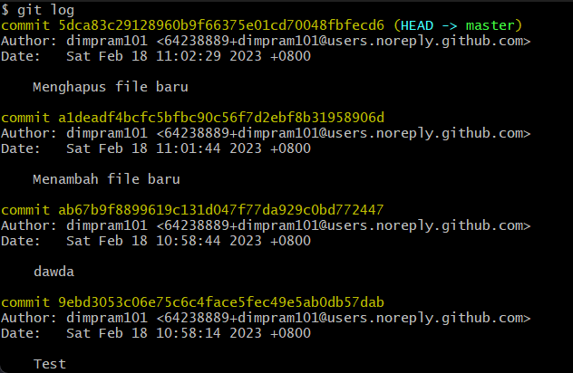
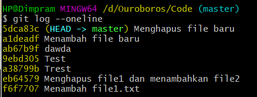

# Commit Log
Git adalah *distributed version control* yang semua riwayat perubahannya tersimpan di dalam komputer kita. Kekurangannya adalah semakin lama Repository akan semakin besar penyimpanannya, namun kita dapat melihat semua riwayat commit yang dapat disebut sebagai Commit Log. Untuk melihat commit log dapat menggunakan command ```git log```.



### Log Sederhana
Untuk melihat commit messagenya saja dapat menggunakan command ```git log -oneline```.


### Graph
Ketika telah memahami *Git Branching*, terkadang kita ingin melihat hubungan commit log dengan commit log yang sebelumnya. Hal ini dapat dilakukan dengan command ```git log --graph```.

### Melihat Detail Commit
Untuk melihat detail perubahan yang terjadi pada sebuah commit dapat menggunakan command ```git show hash```. Hash di sini adalah bentuk kalimat yang terdapat ketika sebuah commit dilakukan.

# Rename File
Git dapat mendeteksi perubahan nama file. Secara sederhananya, rename file merupakan operasi gabungan antara menghapus file dan menambahkan file baru dengan isi yang sama.
