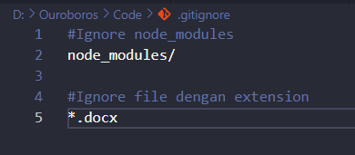

# Ignore
Tidak semua file yang berada di dalam Repository ingin ditrack seperti hasil kompilasi. Git memiliki fitur ignore, di mana kita dapat meminta Git secara otomatis tidak men-track file di Git dengan cara menambahkan sebuah file bernama ".gitignore" ke dalam repository. Lalu kita bisa tambahkan tiap baris di file tersebut berisikan file atau folder yang tidak ingin ditrack.

