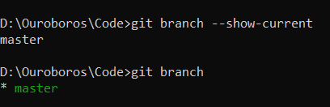
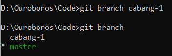
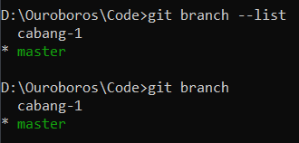
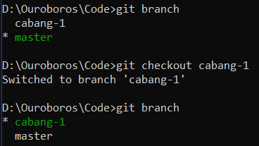
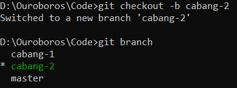
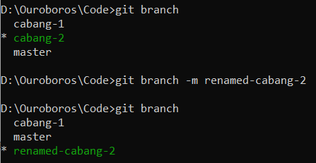
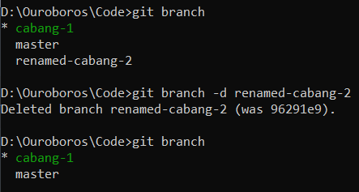

## Melihat Branch
Secara default, Git selalu menyediakan branch utama yang biasa bernama *master* atau *main*. Untuk melihat branch saat ini, kita dapat menggunakan command :

```git branch --show-current``` atau langsung ```git branch```



## Membuat Branch Baru
Untuk membuat branch baru, kita dapat menggunakan command 
``` 
git branch namabranchbaru
```
Ketika membuat branch baru, secara otomatis branch baru akan dimulai dari posisi branch kita saat ini. Jika kita membuat branch baru dari timeline master, maka branch baru tersebut akan membawa semua yang dimiliki timeline master.



## Melihat Seluruh Branch yang Ada.
Untuk melihat seluruh branch yang terdapat pada suatu Repository dapat menggunakan command :
```
git branch --list
```
atau
```
git branch 
```


## Berpindah ke Branch lain.
Setelah membuat branch baru, kita tidak dapat langsung berpindah ke branch baru yang dibuat. Untuk berpindah ke branch lain dapat menggunakan command :
```
git switch namabranch
```
atau
```
git checkout namabranch
```


Sebenarnya ada cara jika ingin langsung berpindah ke branch baru secara langsung ketika dibuat. Yaitu dengan menggunakan command 
```
git checkout -b namabranch
```


## Mengubah Nama Branch
Jika ingin mengubah nama dari suatu branch maka hal pertama yang dilakukan adalah berpindah menuju branch yang ingin diubah namanya, setelah itu dapat menggunakan command
```
git branch -m namabranchbaru
```


## Menghapus Branch
Jika sebuah branch tidak digunakan lagi dan ingin segera dihapus, maka yang harus dilakukan adalah jika sedang berada di branch yang ingin dihapus, maka diharuskan untuk keluar dari branch tersebut. Setelah itu dapat menggunakan command 
```
git branch -d namabranch
```
atau
```
git branch -delete namabranch
```

