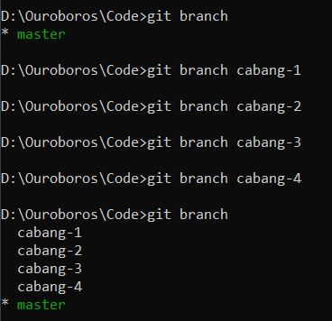
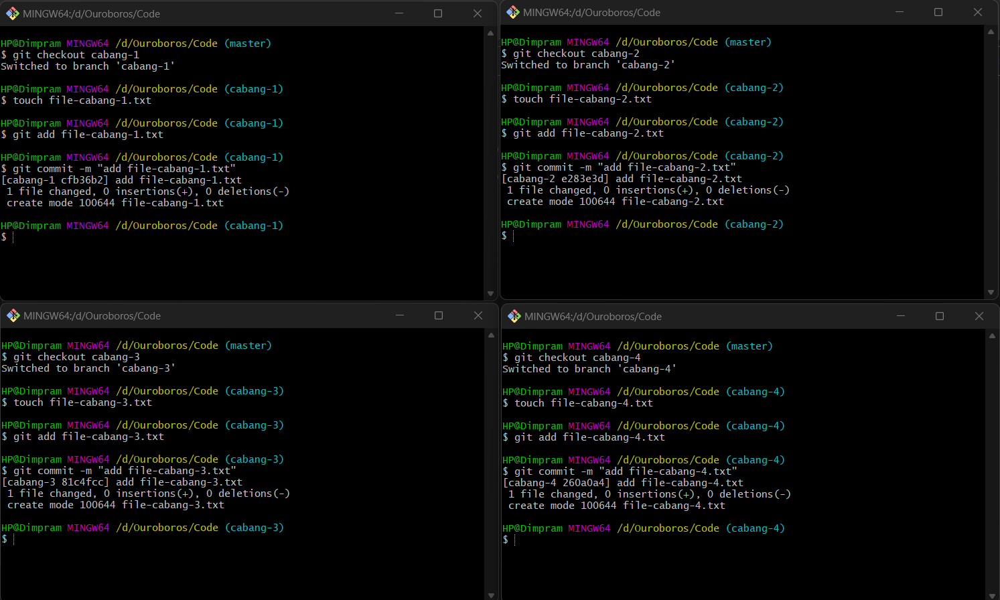

# Multiple Branch
Kenyataannya, ketika membuat aplikasi, maka akan ada banyak branch yang digunakan. Git mendukung multiple branch, yang artinya Git dapat menangani branch sebanyak apapun yang kita miliki.

### Menggunakan Multi Branch
  

Jika melakukan hal seperti di atas, kita dapat melihat repository kita pada setiap branch. Kita dapat melihat bahwa setiap file yang kita commit pada setiap branch tidak terlihat pada branch lain. Itu karena kita belum melakukan merge pada branch-branch tersebut.