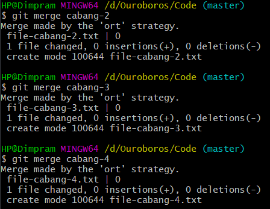
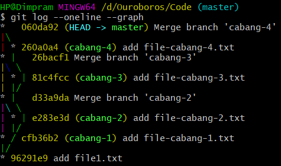

# Merge
Merge adalah proses di mana kita menggabungkan dua buah branch menjadi satu. Biasanya dilakukan setelah kita selesai membuat kode di suatu branch, dan ingin menggabungkan fitur tersebut ke branch lain. Saat kita melakukan merge, branch tidak akan dihapus, sehingga kita masih dapat melakukan commit pada branch tersebut.

### Melakukan Merge
Untuk melakukan Merge, pertama-tama kita harus pindah ke branch lokasi di mana kita akan melakukan merge, setelah 
itu dapat menggunakan command 
```
git merge namabranch
```
  

##### Log


