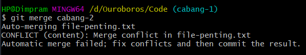
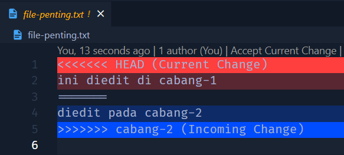
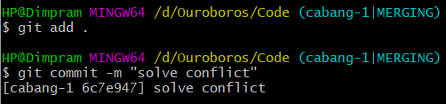

# Merge Conflict
Dalam pembuatan aplikasi, biasanya kita akan melakukan penambahakan kode secara paralel yang dibuat pada branch masing-masing. Namun, pasti ada kemungkinan jika orang lain akan mengubah file yang sama. Sehingga ketika melakukan merge akan terjadi konflik dan agar dapat memperbaikinya kita perlu melakukan Merge Conflict.



## Membatalkan Conflict
Jika terjadi conflict, maka kita harus menyelesaikan atau memperbaikinya dahulu. Semua perubahan yang tidak conflict akan secara otomatis berada di Staging Index. Sedangkan perubahan yang conflict akan berada di Working Directory. Jika ingin membatalkan merge, kita dapat menggunakan command 
```
git merge --abort
```
Secara otomatis seluruh perubahan di branch yang ingin kita merge akan dihapus.

## Memperbaiki Conflict
Tidak ada cara otomatis untuk memperbaiki conflict. Kita harus melakukannya secara manual. Dan setelah perbaikan dilakukan, maka kita perlu melakukan commit perubahan tersebut.



