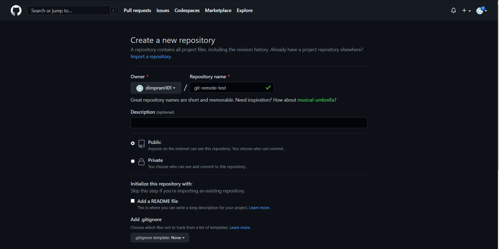
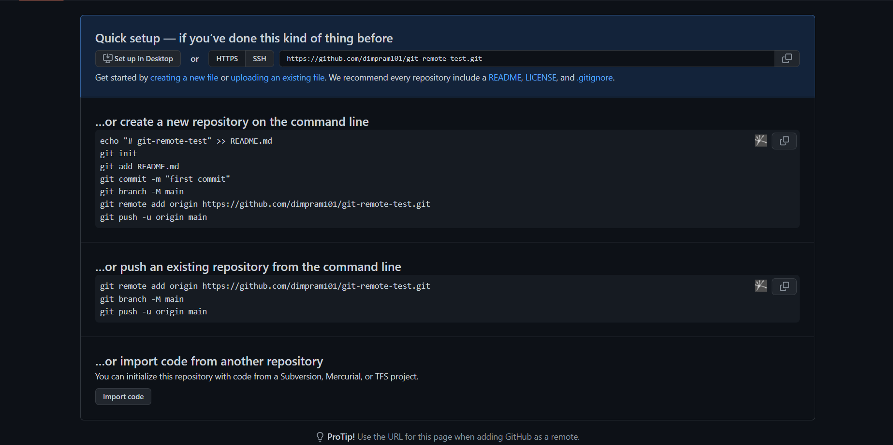
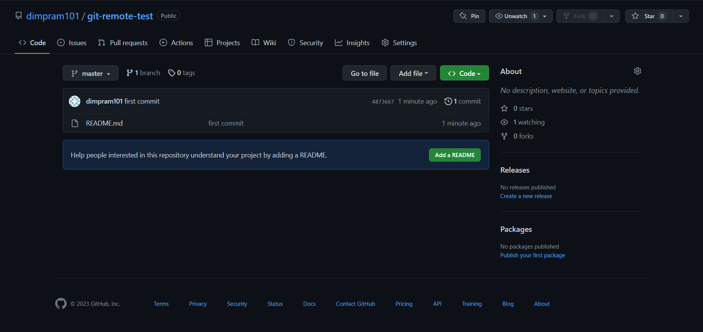

# Github
Pertama-tama silahkan buat akun pada [Github](https://github.com). Setelah itu pergi untuk membuat repository baru.


Kemudian kita akan menghubungkan repository tersebut dengan repository local di komputer kita. Kita dapat mengikuti instruksi di bawah ini.



Jika berhasil mengikuti instruksi sesuai maka tampilan repository pada Github akan menjadi seperti ini.


## Push
Walaupun kita sudah menyimpan perubahan Git Project di local, tapi tidak secara otomatis akan di-*sync* dengan Remote Repository. Hal ini karena sejak awal Git didesain sebagai distributed version control, artinya kita dapat melakukan perubahan di manapun dan kapanpun tanpa harus terhubung ke Git Server. Namun ketika ingin mengirim perubahan yang terjadi di Git Project, kita perlu mengirimnya secara manual ke Git Server. Untuk mengirim perubahan di local ke Git Server, kita dapat menggunakan perintah *push*.
```
git push namaremote localbranch
```
Biasanya *namaremote* di sini bernama origin.

### Push Semua Branch
Jika kita ingin mengirim seluruh perubahan di semua branch ke remote repository, kita bisa menggunakan command :
```
git push origin --all
```

## Menghapus Branch
Perintah push juga dapat digunakan untuk menghapus branch yang ada di remote repository. Kita dapat menggunakan command 
```
git push --delete namaremote namabranch
```
Perlu diingat, menghapus remote branch bukan berarti menghapus branch di local, sehingga jika kita ingin menghapus branch local, maka kita harus melakukannya secara manual.